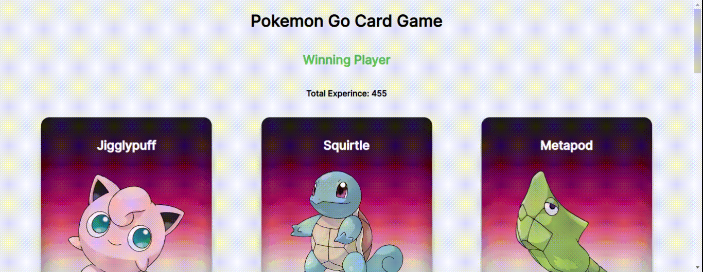

# ReactPokemon

-React ile yapılan uygulama Pokecard.js, Pokedex.js ve Pokegame.js componentlerini içeriyor.

-Pokemen card bilgileri class componet olarak Pokegame componentinde statik olarak tutuluyor.

# ReactPokemonProjesi
